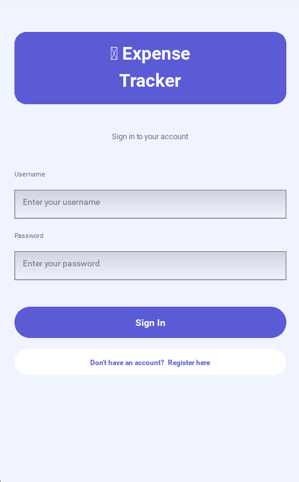
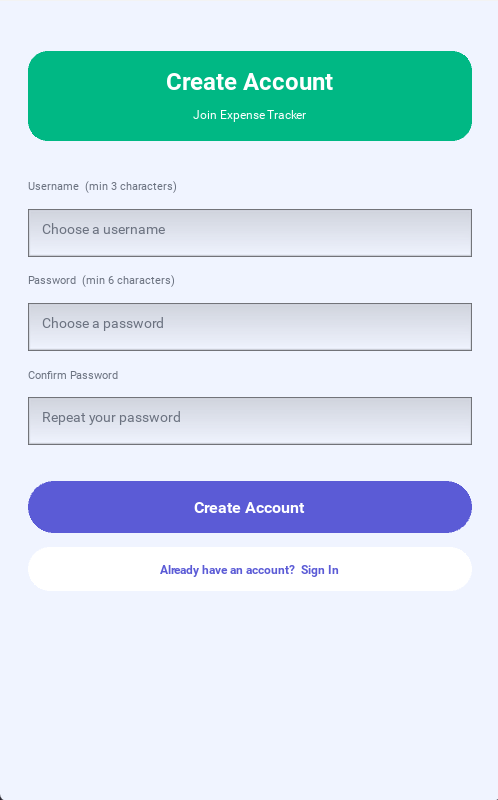
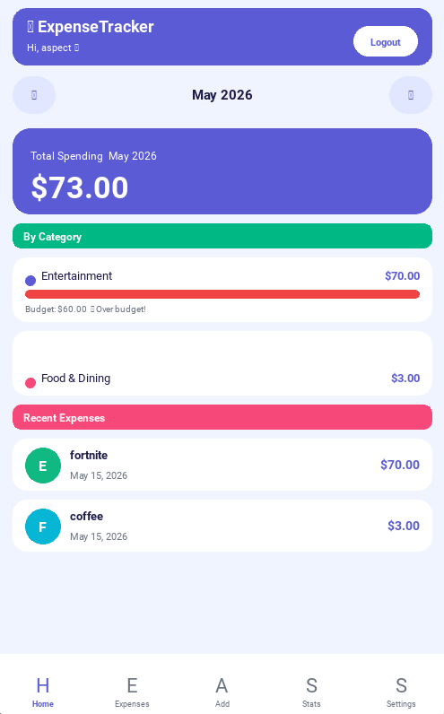
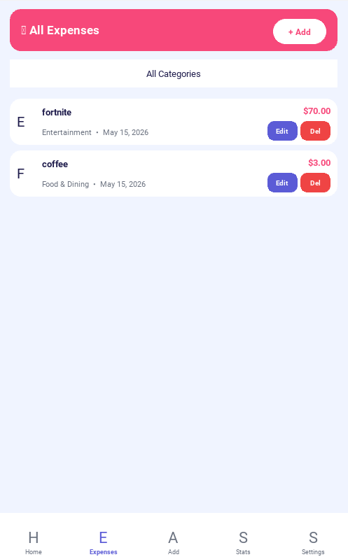
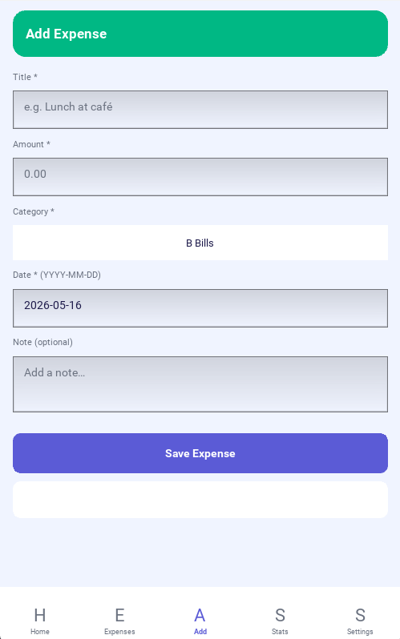
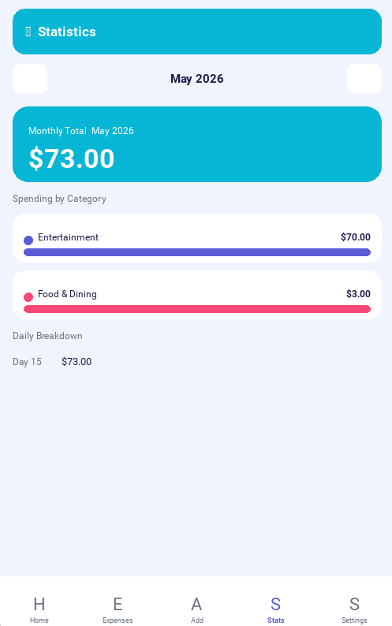
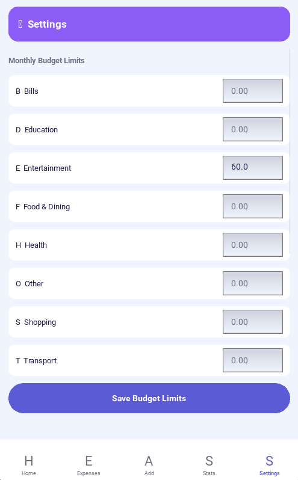
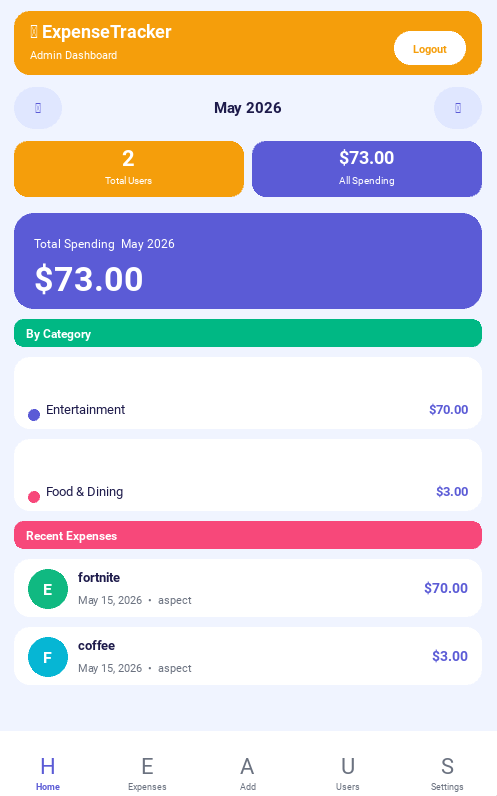
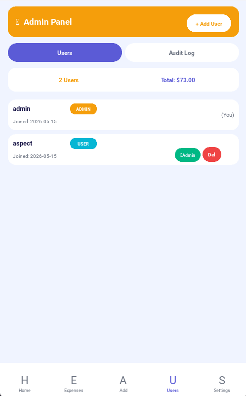

<div align="center">

# 💰 Expense Tracker

### A cross-platform personal finance app built with Python + Kivy + MySQL

[](https://python.org)
[](https://kivy.org)
[](https://mysql.com)
[](https://github.com/iTxAspect/Expense-Tracker-Project)
[](LICENSE)

**Track expenses · Set budgets · Manage users · Export data**

[Features](#-features) · [Screenshots](#-screenshots) · [Quick Start](#-quick-start) · [Architecture](#-architecture) · [Security](#-security) · [Android Build](#-android-build)

</div>

---

## 📋 Overview

Expense Tracker is a fully-featured personal finance application that runs on **Android and desktop (Windows / Linux)**. It lets users log daily expenses, set per-category monthly budgets, visualise spending trends, and export data to CSV. A built-in **Admin role** provides platform-wide oversight — user management, role control, and a complete audit trail.

### Key Highlights

- 🔐 **Secure authentication** — PBKDF2-SHA256 password hashing + brute-force lockout
- 👥 **Two-role system** — User and Admin with strict data isolation
- 📊 **Live dashboard** — Monthly totals, category breakdown, budget progress bars
- 📤 **CSV export** — One-tap data export from Settings
- 🗄️ **MySQL backend** — Production-grade relational storage with FK constraints
- 🔍 **Audit log** — Every admin action is recorded with actor + timestamp
- 📱 **Cross-platform** — Runs on Android (Buildozer) and desktop (Kivy)

---

## ✨ Features

### For All Users
| Feature | Description |
|---|---|
| 🔑 Login / Register | Secure account creation and sign-in with PBKDF2 hashed passwords |
| 🏠 Dashboard | Monthly spending total, per-category bars, recent expenses list |
| 📋 Expenses List | Scrollable list with category filter, inline Edit and Delete |
| ➕ Add / Edit Expense | Form with title, amount, category (8 built-in), date, and optional note |
| 📊 Statistics | Monthly total card, spending-by-category chart, daily breakdown |
| ⚙️ Settings | Set monthly budget limits per category, change password, export CSV |
| 📤 CSV Export | Download all expenses as a timestamped CSV file |
| 🔔 Budget Alerts | Red progress bar + warning when spending exceeds a category budget |
| 🗓️ Month Navigation | Browse any past or future month with ◀ ▶ arrows |

### Admin-Only Features
| Feature | Description |
|---|---|
| 👑 Admin Dashboard | Shows total users, all-user spending, and platform-wide category breakdown |
| 👥 User Management | View all accounts, create users, delete users (cascade-deletes their data) |
| 🔄 Role Control | Promote users to admin or demote admins — with last-admin protection |
| 🔓 Unlock Accounts | Manually unlock accounts locked by brute-force protection |
| 📜 Audit Log | Full colour-coded event log — LOGIN, LOCKOUT, CHANGE_ROLE, DELETE_USER, and more |
| 📊 Global Statistics | Per-user spending breakdown in the Stats screen |

---

## 📸 Screenshots

### Authentication

| Login Screen | Register Screen |
|:---:|:---:|
|  |  |
| Sign in with username & password | Create a new account (min 6-char password) |

---

### User Dashboard



The dashboard shows:
- **Month navigation** — tap ◀ ▶ to browse any month
- **Total Spending card** — large indigo card with the month's total
- **By Category** — coloured dot per category with amount and budget progress bar
- **⚠️ Over-budget alert** — red bar + warning when limit exceeded
- **Recent Expenses** — last 5 transactions with coloured icon circles

---

### Expense Management

| All Expenses | Add Expense |
|:---:|:---:|
|  |  |
| Filter by category · Edit · Delete | Title · Amount · Category · Date · Note |

---

### Statistics & Settings

| Statistics | Settings |
|:---:|:---:|
|  |  |
| Monthly chart · Daily breakdown | Budget limits · Change password · CSV export |

---

### Admin Screens

| Admin Dashboard | Admin Panel |
|:---:|:---:|
|  |  |
| Total users · All spending · Category view | Users tab · Audit Log tab · Add/delete/unlock |

> **Admin credentials (first run):** `username: admin` · `password: Admin123`
> Change this immediately in Settings → Change Password.

---

## 🚀 Quick Start

### Desktop (Windows / Linux / macOS)

```bash
# 1. Clone the repo
git clone https://github.com/iTxAspect/Expense-Tracker-Project.git
cd Expense-Tracker-Project/app

# 2. Install Python dependencies
pip install kivy==2.3.0 mysql-connector-python

# 3. Make sure MySQL is running, then set your credentials in database.py:
#    DB_CONFIG = { "user": "root", "password": "yourpassword", ... }

# 4. Run the app
python gui.py
```

The database and all tables are created automatically on first run.

### Default Admin Account

```
Username : admin
Password : Admin123
```

> ⚠️ Change this password immediately after first login via **Settings → Change Password**.

---

## 🗂️ Project Structure

```
Expense-Tracker-Project/
├── app/
│   ├── gui.py              # Kivy GUI — all 8 screens and widgets
│   ├── logic.py            # Business logic — auth, RBAC, validation, export
│   ├── database.py         # MySQL persistence layer — all SQL queries
│   ├── buildozer.spec      # Android build configuration
│   └── fontawesome-webfont.ttf  # Icon font (bundled with APK)
├── tests/
│   └── test_logic.py       # pytest test suite — 60+ test cases
├── .github/
│   └── workflows/
│       ├── ci.yml          # Full CI/CD — lint, test, security, APK build
│       ├── pr-check.yml    # Fast PR check (syntax + tests)
│       └── nightly.yml     # Nightly matrix — Python 3.10–3.13
├── docs/
│   ├── risk_analysis.docx  # Risk register, roadmap, testing plan
│   └── expense_tracker.puml # PlantUML architecture diagram
├── pytest.ini
├── requirements.txt
├── requirements-dev.txt
└── README.md
```

---

## 🏛️ Architecture

The app uses a strict **3-layer architecture** so each layer can be changed independently:

```
┌─────────────────────────────────────────────┐
│              gui.py  (Presentation)          │
│  Kivy screens, widgets, navigation, themes   │
│  Never imports database.py directly          │
└─────────────────┬───────────────────────────┘
                  │ calls
┌─────────────────▼───────────────────────────┐
│             logic.py  (Business Logic)       │
│  Auth, RBAC, validation, formatting, export  │
│  Session state (current_user)                │
└─────────────────┬───────────────────────────┘
                  │ calls
┌─────────────────▼───────────────────────────┐
│           database.py  (Persistence)         │
│  MySQL queries, schema init, aggregations    │
│  All SQL contained here — no leakage         │
└─────────────────────────────────────────────┘
```

### Database Schema (6 Tables)

```sql
users          -- id, username, password (hash), role, is_locked, locked_until
categories     -- id, name, icon, color  (8 defaults seeded on startup)
expenses       -- id, user_id (FK→users CASCADE), title, amount, category_id, date, note
budgets        -- user_id + category_id (UNIQUE), monthly_limit
login_attempts -- username, success, attempted_at  (brute-force tracking)
audit_log      -- actor_id (FK→users SET NULL), action, target, detail, created_at
```

### OOP Principles Applied

| Principle | Where |
|---|---|
| **Encapsulation** | All SQL in `database.py`. Private helpers `_hash_password()`, `_uid()`, `_audit()` in `logic.py`. `ColoredBox._draw()` in `gui.py`. |
| **Inheritance** | `ColoredBox → NavBar`. `BaseScreen → Dashboard / Expenses / AddExpense / Stats / Settings / AdminPanel`. `App → ExpenseTrackerApp`. |
| **Polymorphism** | Every screen overrides `on_enter()` and `_build()` independently. `NavBar` switches tabs by role at runtime. `get_expenses()` returns different scopes via `_uid()`. |

---

## 🔒 Security

### Authentication
- Passwords hashed with **PBKDF2-HMAC-SHA256**, 260,000 iterations, random 16-byte salt per account
- Stored as `"salt$hash"` — plain text is never written anywhere
- `hmac.compare_digest()` prevents timing attacks during verification

### Brute-Force Protection
- **5 failed logins** within 30 minutes → account locked for 30 minutes
- Remaining attempts shown after each failure: *"Incorrect password. 3 attempt(s) remaining."*
- Lockout auto-expires; admins can unlock manually from the Admin Panel

### Role-Based Access Control
- Every admin function begins with `is_admin()` guard
- Regular users physically cannot retrieve another user's data — enforced at SQL level via `user_id` filter
- `update_expense()` and `delete_expense()` verify ownership before any change
- Last-admin protection prevents the system being left without an administrator

### SQL Injection Prevention
- All queries use **parameterised `%s` placeholders** — user input is never concatenated into SQL
- `sanitise()` strips control characters and enforces max lengths on all free-text fields

### Audit Log
Every sensitive action is permanently recorded:

| Action | Trigger |
|---|---|
| `LOGIN` / `LOGOUT` | Every sign-in and sign-out |
| `LOCKOUT` | Account locked after 5 failures |
| `UNLOCK_USER` | Admin manually unlocks an account |
| `CHANGE_ROLE` | Admin promotes or demotes a user |
| `DELETE_USER` | Admin deletes an account |
| `CHANGE_PASSWORD` | User changes their password |
| `EXPORT_CSV` | User exports expense data |

---

## 📱 Android Build

> **Windows users:** Buildozer requires Linux. Use WSL (recommended) or a Linux VM.

### Step 1 — Install WSL (Windows only)

```powershell
# Run in PowerShell as Administrator
wsl --install
# Restart, then open Ubuntu from Start menu
```

### Step 2 — Install Build Dependencies (WSL / Ubuntu)

```bash
sudo apt update && sudo apt install -y \
    git zip unzip openjdk-17-jdk build-essential \
    libssl-dev libffi-dev python3-dev autoconf \
    libtool pkg-config zlib1g-dev cmake

pip3 install buildozer cython==0.29.36
```

### Step 3 — Prepare Project

```bash
# Rename gui.py to main.py (Buildozer requirement)
cp app/gui.py app/main.py

# Use SQLite version of database.py for Android
# (MySQL cannot run on-device)
```

### Step 4 — Build APK

```bash
cd app
buildozer android debug
# First build downloads ~4 GB of Android SDK/NDK — takes 30–60 min
# Subsequent builds: ~5–10 min (cached)
```

APK location: `app/bin/expensetracker-1.0-arm64-v8a-debug.apk`

### Step 5 — Install on Device

```bash
# Enable USB Debugging on your phone first:
# Settings → About Phone → tap Build Number 7× → Developer Options → USB Debugging ON

# Then:
adb install bin/expensetracker-1.0-arm64-v8a-debug.apk

# Or deploy directly:
buildozer android debug deploy run
```

### Common Build Errors

| Error | Fix |
|---|---|
| `main.py not found` | Rename `gui.py` → `main.py` |
| `No module named mysql` | Remove `mysql-connector-python` from requirements in `buildozer.spec` |
| `SDK not found` | Re-run `buildozer android debug` — it auto-downloads |
| App crashes on open | Run `adb logcat \| grep python` to see the Python traceback |
| Font not rendering | Ensure `ttf` is in `source.include_exts` in `buildozer.spec` |

---

## 🧪 Testing

```bash
# Install dev dependencies
pip install -r requirements-dev.txt

# Run full test suite with coverage
pytest tests/ --cov=app --cov-report=term-missing

# Run quick check (no coverage)
pytest tests/ -q
```

**Test coverage:** 60+ test cases across 9 classes covering authentication, brute-force lockout, expense CRUD, ownership enforcement, budget logic, admin management, and helper functions.

Coverage target: **≥ 85%** on `database.py` and `logic.py` (`gui.py` excluded — Kivy is headless-incompatible).

---

## ⚙️ Configuration

### MySQL Setup (first time)

```sql
-- Run as MySQL root
CREATE DATABASE expense_tracker
  CHARACTER SET utf8mb4 COLLATE utf8mb4_unicode_ci;

CREATE USER 'expense_user'@'localhost' IDENTIFIED BY 'StrongPass123!';
GRANT ALL PRIVILEGES ON expense_tracker.* TO 'expense_user'@'localhost';
FLUSH PRIVILEGES;
```

Then update `DB_CONFIG` in `database.py`:

```python
DB_CONFIG = {
    "host":     "localhost",
    "port":     3306,
    "user":     "expense_user",       # ← your MySQL username
    "password": "StrongPass123!",     # ← your MySQL password
    "database": "expense_tracker",
    "charset":  "utf8mb4",
    "autocommit": False,
}
```

All tables and default categories are created automatically when the app starts for the first time.

### Environment

| Variable | Default | Description |
|---|---|---|
| MySQL host | `localhost` | Edit `DB_CONFIG` in `database.py` |
| MySQL port | `3306` | Edit `DB_CONFIG` in `database.py` |
| Admin username | `admin` | Auto-seeded on first run |
| Admin password | `Admin123` | **Change immediately after first login** |
| Lockout threshold | `5` attempts | `MAX_FAILED_ATTEMPTS` in `logic.py` line 34 |
| Lockout duration | `30` minutes | `LOCKOUT_MINUTES` in `logic.py` line 35 |

---

## 📦 Dependencies

### Runtime

```
kivy==2.3.0
mysql-connector-python
```

### Development / CI

```
pytest>=7.4
pytest-cov>=4.1
pytest-timeout>=2.2
flake8>=6.1
pylint>=3.0
bandit>=1.7
pip-audit>=2.6
```

Install all dev tools: `pip install -r requirements-dev.txt`

---

## 🗺️ Roadmap

| Phase | Status | Deliverables |
|---|---|---|
| 1 — Core MVP | ✅ Done | SQLite schema, 5 Kivy screens, NavBar, budget bars |
| 2 — Auth & Roles | ✅ Done | Login/Register, PBKDF2 hashing, RBAC, Admin Panel |
| 3 — Security Hardening | ✅ Done | Brute-force lockout, audit log, MySQL migration, DB indexes |
| 4 — Data Management | ✅ Done | CSV export, colourful UI theme, Settings overhaul |
| 5 — Polish & Release | 🔄 In Progress | Full regression tests, CI/CD, Google Play listing |

### Planned Features

- 🔒 **SQLCipher** — AES-256 database encryption at rest for production Android
- 📧 **Email notifications** — Over-budget alerts via SMTP
- 💱 **Multi-currency** — Currency selector with conversion
- 📊 **Advanced analytics** — Year-over-year trends, forecasting
- 🌙 **Theme toggle** — User-selectable dark / light mode

---

## 🤝 Team

| Name | Role |
|---|---|
| **Najm Yaslam** | Team Leader · Architecture · Database |
| **Ibrahim Aldolaaee** | Backend Developer · Auth · Security |
| **Khalid Alghanemi** | Frontend / UI · Kivy screens · Theme |
| **Ahmed Alhashedi** | QA / DevOps · Test suite · CI/CD |

---

## 📄 License

This project is licensed under the MIT License — see [LICENSE](LICENSE) for details.

---

<div align="center">

**💰 Expense Tracker** — Built with Python, Kivy, and MySQL

[⬆ Back to top](#-expense-tracker)

</div>
